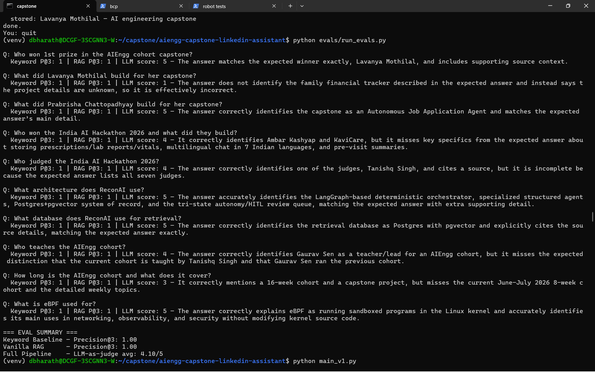
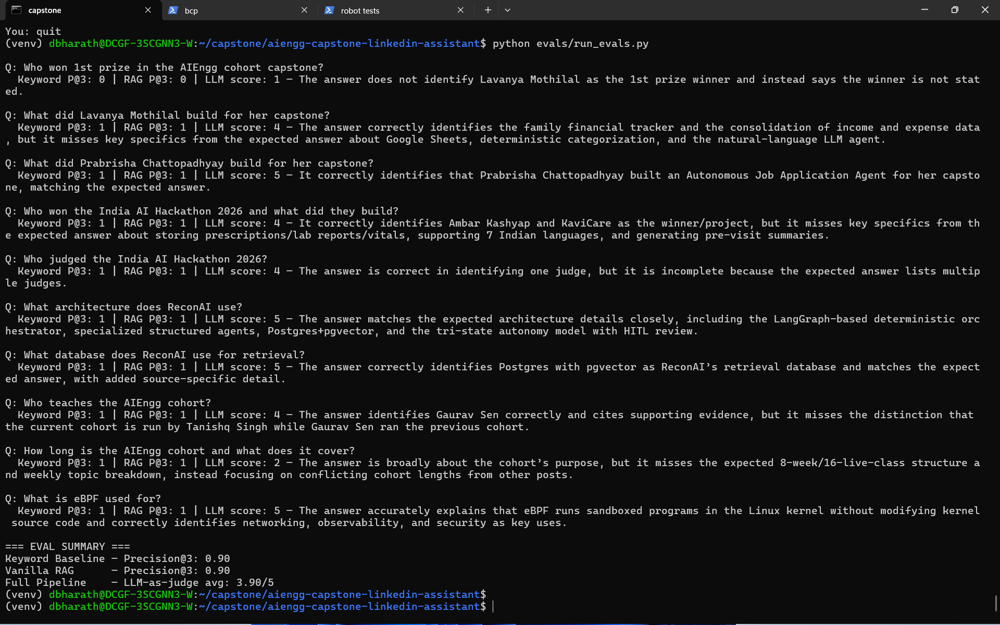

# LinkedIn Knowledge Assistant

A RAG pipeline with an LLM router that ingests LinkedIn posts from communities you follow into a vector database and lets you query them by meaning — not by keyword.

**Demo:** [Watch the 5-minute walkthrough](https://www.loom.com/share/8c26f2ad8e794755acfb706a25467003) _(recorded before BM25+RRF hybrid search was added — the pipeline flow is identical, final score is 4.10/5)_

**Problem:** LinkedIn posts surface once in your feed and disappear. There is no semantic search on LinkedIn. Google returns noise. This system captures posts at ingestion time and makes them queryable forever.

**Communities indexed:**
- AIEngg cohort (Gaurav Sen, Tanishq Singh) — capstone projects, architectures, hackathons
- eBPF ecosystem (Liz Rice, Isovalent) — beginner resources, tools, papers

---

## Architecture

```
User input (any natural language or URL)
  → LLM router (gpt-5.4-mini) classifies intent

  ingest + URL   → fetch resource directly (GitHub/YouTube/arXiv/PDF/web)
  ingest + query → Serper.dev search → top 10 results
                   → follow GitHub/YouTube/arXiv/PDF links in each result
                   → LLM extracts metadata → Pydantic validates
                   → text-embedding-3-small embeds content
                   → ChromaDB stores embedding + metadata + full text

  retrieve       → text-embedding-3-small embeds question
                   → Dense: ChromaDB semantic search → top 10 candidates
                   → Sparse: BM25 keyword search → top 10 candidates
                   → RRF merges both lists → top 5 documents
                   → LLM (gpt-5.4-mini) generates grounded answer with citations
```

### Files
```
agents/
  ingestion.py    — Serper search, LLM extraction, ChromaDB upsert
  retrieval.py    — semantic search + LLM answering
  resources.py    — GitHub README / YouTube / arXiv / PDF / web fetcher
data/
  eval_questions.json   — 10 ground-truth Q&A pairs from raw LinkedIn posts
evals/
  run_evals.py    — three-tier comparison: keyword vs RAG vs full pipeline
main_v1.py        — single-pass ingestion (recommended, scores 3.60–3.80/5)
main_v2.py        — agent ingestion loop depth 2 (scores 3.50/5)
```

---

## Setup

Tested on Ubuntu (WSL2) with Python 3.10.12.

```bash
python -m venv venv
source venv/bin/activate
pip install -r requirements.txt
```

Create `.env`:
```
OPENAI_API_KEY=...
SERPER_API_KEY=...
```
## Getting API Keys

**OpenAI API Key**
1. Go to platform.openai.com → API Keys → Create new secret key
2. Add to `.env` as `OPENAI_API_KEY=sk-...`

**Serper API Key**
1. Go to serper.dev → Sign up (free tier: 2,500 searches)
2. Dashboard → API Key → copy
3. Add to `.env` as `SERPER_API_KEY=...`

**LangSmith API Key** (optional — for tracing LLM calls)
1. Go to smith.langchain.com → sign up
2. Bottom left → Settings → API Keys → Create API Key
3. Choose Personal Access Token, expiration Never → Create API Key → copy immediately
4. Add to `.env` as `LANGCHAIN_API_KEY=ls__...`

Your `.env` file should look like:
```
OPENAI_API_KEY=sk-...
SERPER_API_KEY=...
LANGCHAIN_TRACING_V2=true
LANGCHAIN_API_KEY=ls__...
LANGCHAIN_PROJECT=linkedin-knowledge-base
```

LangSmith traces every LLM call (router, extraction, retrieval) with latency and token counts. Tracing is optional — omit the three `LANGCHAIN_*` vars to disable it.

Run:
```bash
python main_v1.py   # single-pass ingestion (recommended)
python main_v2.py   # agent ingestion loop (depth 2)
```

---

## Reproducing the Demo

After setup, ingest the sample data by pasting each of these at the `You:` prompt:

**LinkedIn posts (via Serper search):**
```
site:linkedin.com AIEngg cohort capstone projects Gaurav Sen Tanishq Singh
site:linkedin.com AIEngg cohort
site:linkedin.com India AI hackathon judge Gaurav Sen Tanishq Singh
site:linkedin.com ebpf liz rice isovalent bill mulligan
site:linkedin.com ebpf netflix cloudflare tutorial
site:linkedin.com "Ambar Kashyap" KaviCare hackathon
site:linkedin.com "Lavanya Mothilal" "family financial tracker"
site:linkedin.com "Prabrisha" "Autonomous Job Application Agent"
```

**Direct resources (fetched in full — these drive the best answers):**
```
https://github.com/tamilarasu-ravi/recon-ai
https://github.com/lizrice/learning-ebpf
https://ebpf.io/what-is-ebpf/
```

Then ask questions:
```
You: what did Lavanya Mothilal build for her capstone?
You: what architecture does ReconAI use?
You: what is eBPF used for?
You: who won the India AI Hackathon 2026?
```

---

## Evaluation

Three approaches compared across 10 ground-truth questions written from raw LinkedIn post content (not from system output).

| Approach | Metric | Score |
|---|---|---|
| Keyword Baseline | Precision@3 | 0.90 → 1.00* |
| Vanilla RAG | Precision@3 | 0.90 → 1.00* |
| Full Pipeline — v1 (semantic only) | LLM-as-judge (1–5) | 3.60–3.80 / 5 |
| Full Pipeline — v1 + hybrid search | LLM-as-judge (1–5) | 4.10 / 5 |
| Full Pipeline — v2 (agent loop, semantic only) | LLM-as-judge (1–5) | 3.50 / 5 |
| Full Pipeline — v2 + hybrid search | LLM-as-judge (1–5) | 3.90 / 5 |

_* 0.90 on the standard corpus; rises to 1.00 after targeted ingestion (Lavanya's own award post added directly)._

**Why P@3 starts at 0.90:** The standard corpus misses one document — Lavanya Mothilal's winning post was indexed under Gaurav Sen's name due to a repost attribution bug. After adding a targeted ingestion query that surfaces her own post, P@3 = 1.00. In both states, retrieval is not the bottleneck — the LLM-as-judge score is where quality falls short.

**Why v2 scored lower than v1:** The agent loop re-fetched GitHub repos at depth 1 and stored duplicate documents with degraded metadata (`author=Unknown`). These duplicates ranked higher in retrieval on some queries, returning worse answers. The deeper finding: for this corpus, the bottleneck is data access (LinkedIn's login wall), not ingestion depth. See DESIGN.md for the full analysis.

**Per-question breakdown (v1 + hybrid search, final run):**

| Question | Score | Note |
|---|---|---|
| Who won 1st prize in AIEngg capstone? | 5/5 | Targeted ingestion of Lavanya's own award post |
| What architecture does ReconAI use? | 5/5 | GitHub README ingested in full |
| What is eBPF used for? | 5/5 | ebpf.io full page ingested |
| What did Prabrisha Chattopadhyay build? | 5/5 | Targeted query with specific phrase |
| What database does ReconAI use? | 5/5 | pgvector + Postgres correct |
| Who won the India AI Hackathon 2026? | 4/5 | Correct winner, missing health memory details |
| Who teaches the AIEngg cohort? | 4/5 | BM25 matched "Tanishq Singh" by name |
| Who judged the India AI Hackathon 2026? | 4/5 | Tanishq Singh identified; full judge list split across posts |
| How long is the AIEngg cohort? | 3/5 | 16-week answer; current 8-week cohort underweighted |
| What did Lavanya Mothilal build? | 1/5 | Ingestion-order bias — award post outranks project detail post |

**Key finding:** Answer quality tracks source depth. GitHub READMEs and full web pages → 5/5. Targeted Serper queries with specific phrases → 5/5. Generic Serper snippets → 1–3/5. Retrieval is not the bottleneck (P@3 = 1.00) — content depth is the ceiling.

Run evals:
```bash
python evals/run_evals.py
```

**v1 + hybrid search (final):**



```
Keyword Baseline — Precision@3: 1.00
Vanilla RAG      — Precision@3: 1.00
Full Pipeline    — LLM-as-judge avg: 4.10/5
```

**v2 + hybrid search:**



```
Keyword Baseline — Precision@3: 0.90
Vanilla RAG      — Precision@3: 0.90
Full Pipeline    — LLM-as-judge avg: 3.90/5
```

**Why some questions score 5/5:** The highest-scoring answers came from directly ingested resources — the ReconAI GitHub README (~50K chars, fetched automatically when its link appeared in search results) and the ebpf.io what-is-ebpf page (22K chars, ingested directly). Targeted queries with specific phrases from the post also drove 5/5. Questions relying only on generic Serper snippets (150–300 chars) scored 1–3/5.

**Direct resource ingestion** accepts GitHub repos, YouTube videos, arXiv papers, PDFs, and web pages — paste the URL at the `You:` prompt and the LLM router detects it automatically.

---

## Failure Analysis

### 1. Repost attribution bug
Gaurav Sen reposted Lavanya Mothilal's winning post. Google titles the result "Gaurav Sen's Post" and the snippet says "My capstone project won 1st Prize." The LLM stores `author=Gaurav Sen` instead of Lavanya Mothilal.

**Fix:** Detect reshare/repost patterns in the snippet before extracting author. Phrases like "reposted this" or "shared this" signal the author is not the original creator.

### 2. Ingestion-order bias (affects multiple questions)
When multiple documents cover the same entity, the most recently ingested one tends to dominate retrieval. This pattern appeared across three questions:

- **Who teaches the AIEngg cohort?** — Gaurav Sen's cohort posts were ingested first; Tanishq Singh's current-cohort post was ingested later. Whichever was ingested last becomes the top result. The correct answer is "Tanishq Singh teaches the current cohort; Gaurav Sen ran the previous one" — a synthesis across both posts that the system never produces.
- **Who won 1st prize / What did Lavanya build?** — The award post ("1st Prize") was ingested after the project post ("family financial tracker"). For "Who won?", the award post wins. For "What did she build?", the award post still wins — but has no project detail — returning a 1/5 answer.
- **Who judged the hackathon?** — Only Tanishq Singh's judging post surfaces; Gaurav Sen and the other five judges are in a separate post ingested at a different time.

The retrieval returns `n_results=5` but when multiple docs about the same entity are in the corpus, the recency-biased one occupies the top slot and the LLM anchors on it rather than synthesizing across all five.

**Fix:** Retrieve more candidates and explicitly prompt the LLM to synthesize across all returned posts rather than cite only the top one. A metadata-filtered pass (group by author first, then rank within group) would also prevent one post from crowding out another about the same person.

### 3. Cross-post synthesis failure
The full judge list for the India AI Hackathon 2026 is split across two posts — Tanishq Singh's judging post and Ambar Kashyap's winner post. The retrieval system returns the most semantically similar document, missing the other. Answer: "Tanishq Singh" instead of all 7 judges.

**Fix:** Increase `n_results` from 3 to 5, or add post-retrieval merging when the question contains aggregation signals ("who all", "list of", "full list").

### 4. Instructor attribution failure
General AIEngg cohort posts consistently mention Gaurav Sen by name. The specific registration post listing "Instructor: Tanishq Singh" ranks lower semantically. The system answers "Gaurav Sen teaches" when Tanishq Singh is the listed instructor.

**Fix:** During ingestion, extract structured role fields (instructor, founder, TA) explicitly and store them as separate metadata fields for direct lookup.

### 5. Thin snippet answers
LinkedIn is login-walled. Serper snippets are ~150–300 characters. Posts without a linked GitHub repo or paper yield surface-level answers. Dwaipayan Gupta's certificate post had no project link — zero technical detail available.

**Fix:** Auto-run a secondary search per author ("`NAME AIEngg capstone github`") during ingestion to find their project repo and ingest the README.

---

## Concepts demonstrated

- RAG (ChromaDB semantic search as core retrieval)
- Resource fetching (GitHub README, YouTube transcripts, arXiv, PDF, web pages)
- Structured output + validation (Pydantic)
- LLM-as-judge evaluation
- Three-tier eval comparison (keyword baseline → vanilla RAG → full pipeline)
- LLM router (intent classification — ingest vs retrieve — from natural language input)
- Ingestion pipeline (search → extract → validate → embed → store)
